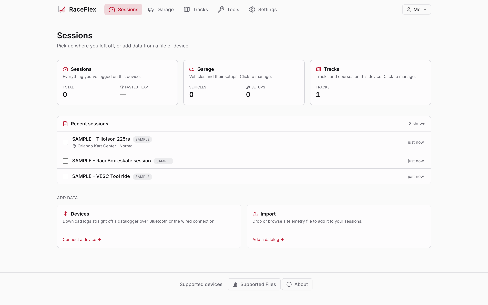
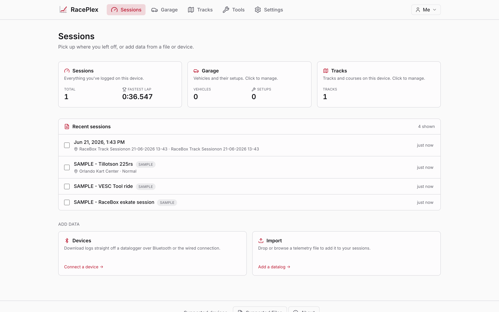
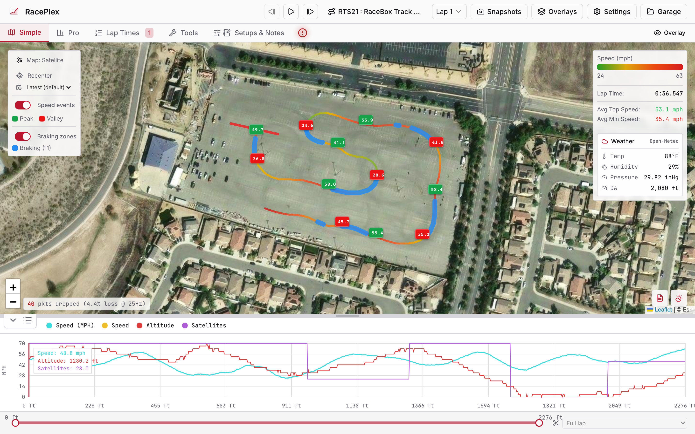
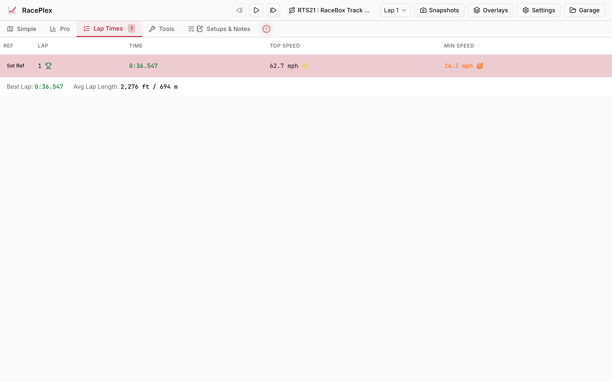
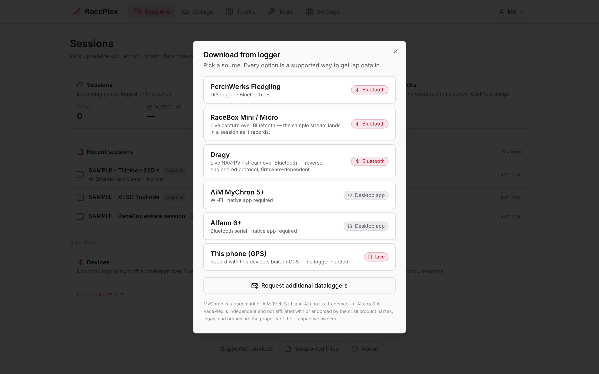
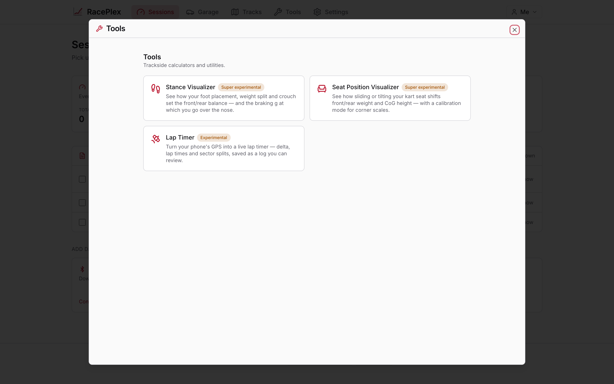
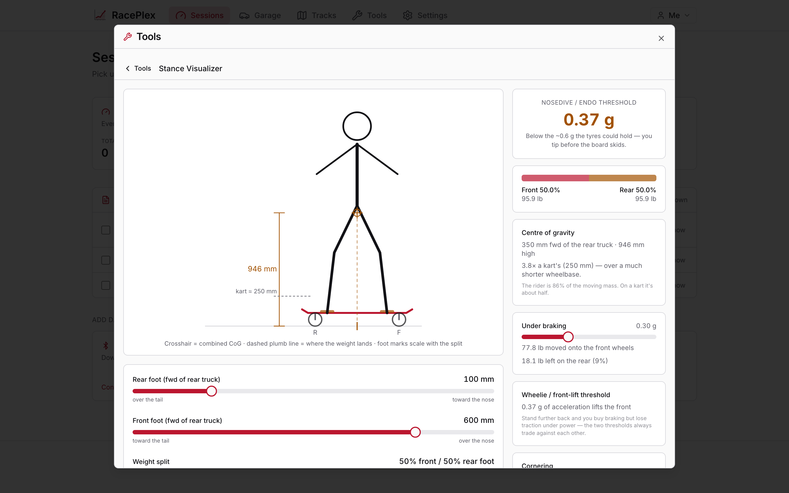
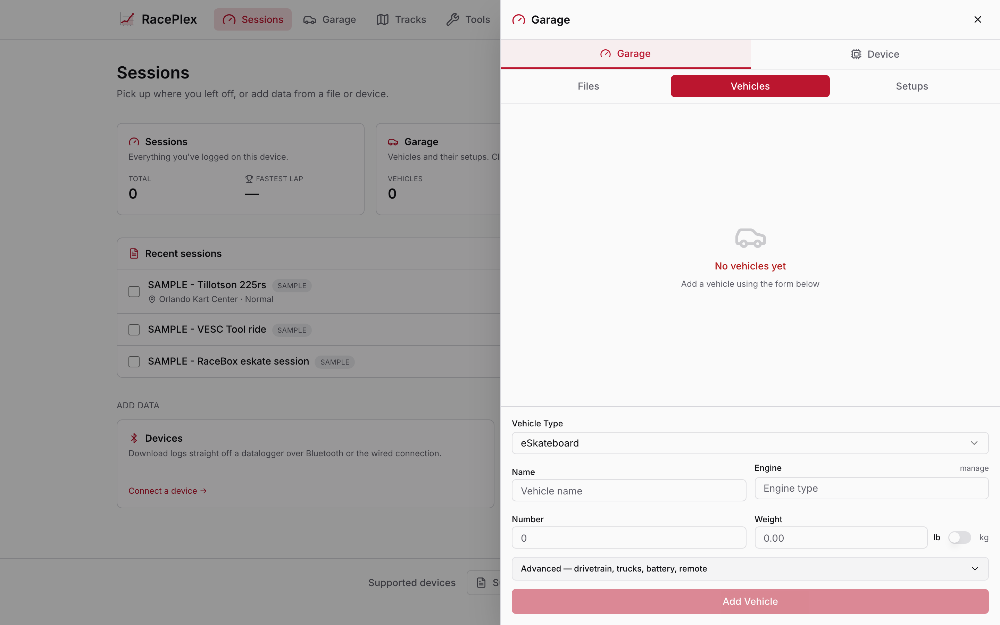
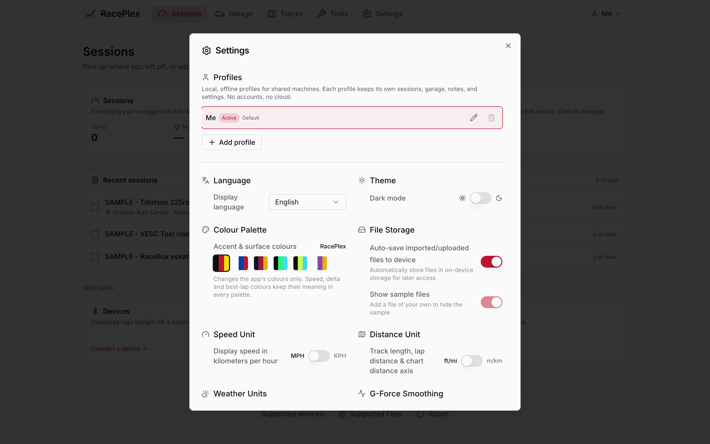

# RacePlex

RacePlex is a lap timing and telemetry analysis application for electric skateboards. It reads ride
logs from GPS meters, phone apps, VESC controllers and GoPro cameras, and presents them as a
speed-coloured track map, lap and sector times, and comparable telemetry charts.

The application runs in your browser. It requires no account and no network connection. Ride data is
parsed locally and stored on your device.

---

## Quickstart

RacePlex has no hosted site. You run your own copy — it is a static web app with no server, no
database and no account, so "running it" means serving a folder of files.

### On a computer

Install [Bun](https://bun.sh), then:

```sh
git clone https://github.com/beadon/RacePlex.git
cd RacePlex
bun install
bun run dev
```

Open **http://localhost:8080**. Three sample rides are already there — open one and you have a map,
lap times and charts without supplying a file.

For the production build instead of the dev server: `bun run build && bun run preview`.

Browsers treat `localhost` as a secure origin, so the offline service worker is active here and
Chrome or Edge will offer **Install RacePlex** in the address bar. Installed, it opens in its own
window and keeps working with the network off.

### On a phone

**The phone needs an HTTPS address.** A browser will only register a service worker — the thing that
makes RacePlex installable and able to run offline — on HTTPS or on `localhost`. Browsing to your
computer's LAN address over `http://` does load the app and it works, but the phone will not offer
to install it and it will not run offline. That is a browser rule, not a RacePlex limitation.

Two ways to give it HTTPS.

**Publish your own copy.** Free, permanent, and the repo is already configured for Cloudflare
Workers static hosting:

```sh
bun run build
npx wrangler deploy
```

That prints an `https://raceplex.<your-subdomain>.workers.dev` address. What you publish is the
application, not your rides — those never leave the device you record them on.

Any static host works. Upload `dist/` and point unknown paths at `index.html` so client-side routes
resolve. (On GitHub Pages, a *project* site is served under a subpath like `/RacePlex/` while this
build assumes the root, so set Vite's `base` first or the assets 404.)

**Or tunnel the dev server** for a quick look, no deploy:

```sh
cloudflared tunnel --url http://localhost:8080
```

Then install it from the phone:

- **Android, Chrome** — menu → **Install app** (sometimes **Add to Home screen**).
- **iOS, Safari** — Share → **Add to Home Screen**.

After the first load it needs no signal. Parsing, lap timing, the charts and the map (from cached
tiles) all run on the phone. Satellite imagery and weather are the only features that want a
network.

---

## Open source

RacePlex is licensed under the GPL-3.0-or-later. Every feature is available to everyone. There are
no paid tiers, no feature gating and no subscription.

**Nothing is uploaded.** Parsing, lap detection and analysis all run in the browser. There is no
server component, no account system and no telemetry. If you disconnect from the network after the
first visit, the application continues to work.

**The reference data is editable without writing code.** Three parts of the project are plain files:

| File | Contents |
|---|---|
| [`src/data/supported-devices.json`](src/data/supported-devices.json) | The device list shown in the application |
| [`tracks/`](tracks/) | The community track collection, one file per track |
| [`docs/research/FORMATS.md`](docs/research/FORMATS.md) | The telemetry format reference |

Adding a device, a track or a format correction is a pull request against one of them.

**You can host it yourself.** `bun run build` produces a static site. It has no backend
requirements, so it can be served from any static host, a local machine, or a device at the track.

---

## Capabilities

**Import.** Reads GPX, VBO, NMEA, UBX, FIT, GoPro `.mp4`, and CSV from RaceBox, VESC Tool,
RaceChrono, MoTeC, AiM, Alfano and Dove. Any other delimited log containing a latitude and a
longitude can be imported through the column mapper.

**Live capture.** Records straight from a RaceBox or a Dragy over Web Bluetooth, with no logger
file to export first. Needs Chrome or Edge, on desktop or Android. A phone's own GPS can also
record, at whatever rate the handset provides.

**Lap and sector timing.** Detects line crossings with sub-sample interpolation, and reports lap
times, sector splits, and a theoretical optimal lap assembled from your best sectors. Supports both
circuits and point-to-point courses.

**Motor telemetry.** VESC logs import with motor current, battery voltage, duty cycle, ERPM and
temperatures charted on the same timeline as the GPS trace.

**Analysis.** Speed-coloured track map, braking-zone detection, reference-lap overlay with pace
delta, G-force plots, and video export with data overlays.

**Setup tools.** A stance model that reports weight distribution and the deceleration at which the
rear wheels unload.

---

## Screens

Every RacePlex install looks the same — no accounts, no plan tiers. These are the surfaces
you'll spend time in.

### Dashboard

Opens to what's already on the device, with an **Add data** zone below. Left is a fresh install
with the bundled sample sessions; right shows the same dashboard after importing a ride.

<p align="center">
  
  
</p>

### Session view

The Simple map view carries the speed-coloured race line, braking-zone markers, satellite tiles,
and a telemetry chart underneath. Lap Times lists every completed lap with top and min speed.

<p align="center">
  
</p>

<p align="center">
  
</p>

### Live capture and download

The device picker offers the PerchWerks Fledgling, RaceBox, Dragy, MyChron, Alfano, and the
device's own GPS. Each shows an honest capability chip so it's clear when a device needs
Chrome/Edge or the desktop app.

<p align="center">
  
</p>

### Tools

Trackside calculators reachable from the nav bar. The **Stance Visualizer** models the
deceleration at which the front wheels unload and the rear leaves the ground — the number
below urethane grip is why boards nosedive instead of skid.

<p align="center">
  
  
</p>

### Garage and settings

The Garage catalogues vehicles, engines, setups, and remotes. Settings hosts profiles for
shared machines, colour palettes, and the three imperial/metric toggles (speed, distance,
weather) that stay independent so a rider can mix them however they read best.

<p align="center">
  
  
</p>

> These are regenerated on every release with `bun run screenshots` (Playwright — see
> [`scripts/screenshots.mjs`](scripts/screenshots.mjs)), so they always match the app that shipped.

---

## Your first session

RacePlex opens on a dashboard listing what is already on the device, with an **Add data** zone
below it.

1. Add a ride: **Import** a log file, or **Devices** to download from a logger or record live.
2. If the file contains timing lines, lap times appear immediately. Otherwise, select or draw a
   course (see [Lap timing](#lap-timing)).
3. Use the tabs to switch between the map, the telemetry charts, and the lap table.

Three sample sessions ship with the application and appear in the list on first run: a RaceBox
eskate session, a VESC Tool ride, and a kart session. Open any of them to try RacePlex without a
file of your own.

---

## Supported formats

| Format | Extension | Notes |
|---|---|---|
| RaceBox CSV | `.csv` | Includes lap numbering, from which RacePlex reconstructs the timing lines. |
| VESC Tool CSV | `.csv` | Includes the ESC channels. See [Motor telemetry](#motor-telemetry). |
| GPX | `.gpx` | Start and Finish waypoints, where present, become timing lines. |
| GoPro video | `.mp4` | GPS is read from the video's GPMF metadata track. Chapter-split recordings fold into one session. |
| FIT | `.fit` | Garmin, Wahoo, Coros, Suunto. These devices log at about 1 Hz — see [Sample rate](#sample-rate). |
| RaceChrono CSV | `.csv` | Version 3 export. |
| VBO | `.vbo` | RaceLogic VBOX. Exported by Dragy·Lap, RaceChrono and RaceBox. |
| NMEA 0183 | `.nmea`, `.txt` | |
| UBX | `.ubx` | u-blox binary. |
| MoTeC i2 | `.ld`, `.csv` | |
| AiM | `.csv`, `.xrk`, `.xrz` | MyChron and SoloDL. |
| Alfano | `.csv` | |
| iRacing | `.ibt` | |
| Dove / Dovex | `.dove`, `.dovex` | |
| Other CSV | `.csv`, `.txt` | Imported through the column mapper. |

Format details, including the layouts and units of each, are documented in
[docs/research/FORMATS.md](docs/research/FORMATS.md).

---

## Supported devices

The full device list — with sample rates, prices and the format to export — is maintained in
[`src/data/supported-devices.json`](src/data/supported-devices.json) and displayed in the
application under **Supported Devices**. To add a device, edit that file and open a pull request.

RacePlex sells no hardware and has no affiliation with any vendor listed.

### Choosing a logger

| | |
|---|---|
| **RaceBox Micro** (~$129) | 25 Hz, IMU, records standalone with a hardware button. Exports GPX, VBO and CSV. The project's test fixtures come from one. |
| **RaceChrono Pro** (~$20) | Phone application. Pair it with a RaceBox or Dragy over Bluetooth for 25 Hz logging. Export VBO, NMEA, GPX, or its own CSV v3 — all four import. |
| **u-blox module** (~$25) | Logs NMEA or UBX to an SD card. The lowest-cost option. |
| **GoPro** | HERO5–11 and HERO13 record 10–18 Hz GPS inside the video. The HERO12 has no GPS receiver. |
| **VESC controller** | Export the ride log from VESC Tool. |

### Sample rate

An eskate run is often shorter than a minute, which makes the GPS sample rate the most significant
specification when choosing a logger. At 40 km/h:

| Rate | Distance between fixes | Typical source |
|---|---|---|
| 1 Hz | 11 m | Phone GPS, sports watches, Strava |
| 10 Hz | 1.1 m | Qstarz, Garmin GLO |
| 25 Hz | 44 cm | RaceBox, Dragy |

At 1 Hz, a 20-second run produces 20 data points, which is not sufficient to locate a braking point
or an apex. If you log with a phone, adding an external Bluetooth GPS receiver raises the rate to
10–25 Hz.

### Dragy

Dragy does not provide a CSV export. Three routes in:

- **Record live** from the Dragy over Web Bluetooth (Chrome or Edge). RacePlex speaks the
  reverse-engineered protocol, which is firmware-dependent.
- Export `.vbo` from the Dragy·Lap application.
- Use the Dragy as a Bluetooth GPS source for RaceChrono and export from there.

---

## Lap timing

RacePlex times a run by detecting where the ride crosses a timing line. Crossing times are
interpolated between GPS samples, so a lap time is not limited to the resolution of the log.

### Courses

A course is a set of timing lines: a start/finish line for a circuit, or separate start and finish
lines for a point-to-point run such as a hill run, a slalom or a drag pass. Split lines divide a lap
into sectors.

Draw a course in the **Track Editor**, or let RacePlex recover one from the file.

### Recovering timing lines from a file

Some logs already record where their timing lines were. RacePlex reads them back, and lap times
appear on import without any setup:

- **GPX files** may contain `Start` and `Finish` waypoints. RacePlex places a timing line at each,
  oriented across your direction of travel at that point.
- **RaceBox CSV files** contain a lap-number column. Each change in the lap number marks a line
  crossing, and the GPS columns record where you were, so the geometry can be reconstructed.

### Optimal lap

The optimal lap is the sum of your fastest time in each sector, taken across every complete lap in
the session. It is at least as fast as your best lap.

---

## Motor telemetry

Export a ride log from VESC Tool and import the CSV. Alongside the GPS trace, the ESC channels are
charted on the same timeline:

- motor current and battery current
- battery voltage
- duty cycle
- ERPM
- motor and controller temperatures
- fault codes and pitch

A VESC controller records ESC data faster than it records GPS fixes. RacePlex keeps the ESC data at
its full rate and interpolates position between fixes, so brief events — a duty-cycle spike lasting
a fraction of a second — remain visible in the chart.

Float Control, pOnewheel, Metr and FreeSK8 logs import through the column mapper below.

---

## Importing an unrecognised log

If your logger is not listed, import its CSV anyway.

RacePlex detects the delimiter, matches the columns by name, and displays the mapping it has chosen
alongside a preview: session duration, sample rate, first coordinate, and top speed.

**Check the preview before importing.** Time and speed units cannot be determined from a column name
alone, so RacePlex infers them and shows the result. If the duration or the top speed is
implausible, correct the column or the unit from the dropdown.

Your correction is saved against that logger's column layout. The same device will not prompt you
again.

This path is known to work with Float Control, pOnewheel, Metr, TrackAddict and Qstarz.

---

## Stance tool

The stance tool models weight distribution on the board. Set the wheelbase, deck height, board and
rider mass, foot positions, weight split, crouch, and which wheels the motors drive; the tool
reports:

- the hardest stop the board can actually make, and what limits it
- static weight distribution, front and rear
- combined centre-of-gravity height
- the braking deceleration at which the rear wheels unload
- the acceleration at which the front wheels lift
- the lean angle required to hold a given cornering force

### Which wheels brake changes the answer

An eskate has no friction brakes. The motors are the brakes, so only the wheels a motor drives can
slow the board down — and that decides what happens when you brake hard.

On a **rear-driven** board (one or two rear motors, which is nearly every board), braking unloads the
rear wheels, which are the wheels doing the braking. As the rear lightens it loses the grip it needs
to brake, so it can never generate enough force to lift itself:

    a_slip / a_endo  =  μ·f·z / (L + μ·f·z)  <  1     always

A dual-rear board tops out around **0.17 g** and the rear breaks traction and slides. It cannot endo
under motor braking, on any geometry. A single rear motor brakes against one wheel instead of two and
slides at around 0.11 g.

On an **all-wheel** board every wheel brakes, so the full weight stays available and the ~0.6 g of
urethane grip is reachable. That board *can* pitch: the rear lifts at around 0.37 g, before the
tyres let go.

The rear-lift threshold stays worth knowing on any board, because a kerb, a pothole or a nose-first
impact applies the decelerating force without needing rear grip. The motors just can't do it to you.

Crouching lowers the centre of gravity and raises every threshold; moving your weight rearward buys
braking and costs you acceleration. The two thresholds always sum to a fixed budget, so a stance
change slides it between the ends rather than growing it.

The model is rigid-body statics. It does not account for deck flex, bushing lean, or how quickly load
transfers, so treat the thresholds as an upper bound.

---

## Development

RacePlex uses Bun. `bun.lock` is committed; other lockfiles are ignored.

```sh
bun install
bun run dev             # http://localhost:8080
bun run test:run        # unit tests
bun run typecheck
bun run verify:import   # drives a browser against sample_race_files/
bun run build
```

A fresh clone runs fully offline. The cloud, authentication and administration features are compiled
out unless you supply your own backend credentials.

Versions come from git tags. There is no `CHANGELOG.md` and no `version` field in `package.json`;
release notes are published in
[GitHub Releases](https://github.com/beadon/RacePlex/releases).

---

## Contributing

Open issues are labelled [help wanted](https://github.com/beadon/RacePlex/labels/help%20wanted).

**Without writing code:**

- **Add a device** to [`src/data/supported-devices.json`](src/data/supported-devices.json).
- **Add a track** to [`tracks/`](tracks/) — one JSON file per track, validated by CI.
- **Correct a format detail** in [`docs/research/FORMATS.md`](docs/research/FORMATS.md).
- **Send a sample export file.** If you own hardware the project has not been tested against, this
  is the most useful contribution available. Every format detail in `FORMATS.md` was established by
  reading a real file. [Issue #15](https://github.com/beadon/RacePlex/issues/15) lists what is
  currently needed.

**Writing code:** device and format support is the easiest place to start. A new parser needs a
detector and a parse function, registration in `datalogParser.ts`, tests against a real file, and an
entry in the supported-formats table.

---

## Credits and licence

RacePlex is a fork of [Dove's DataViewer](https://github.com/TheAngryRaven/DovesDataViewer) by
TheAngryRaven. The VBO, NMEA, MoTeC and AiM parsers, the lap-crossing detection, the sector and
optimal-lap mathematics, and the map and chart layers originate there.

Format support leans on these open-source libraries:

| Library | Used for |
|---|---|
| [fit-file-parser](https://github.com/jimmykane/fit-file-parser) | `.fit` decoding (Garmin, Wahoo, Coros, Suunto) |
| [gpmf-extract](https://github.com/JuanIrache/gpmf-extract) + [gopro-telemetry](https://github.com/JuanIrache/gopro-telemetry) | GoPro GPMF telemetry inside an `.mp4` |
| [mp4-muxer](https://github.com/Vanilagy/mp4-muxer) | Video export (H.264 + AAC) |
| [Leaflet](https://leafletjs.com) | Maps |
| [libxrk](https://github.com/m3rlin45/libxrk) | AiM `.xrk` / `.xrz` (pure-Rust core, compiled to WebAssembly) |

Licensed GPL-3.0-or-later. See [LICENSE](LICENSE) and [NOTICE](NOTICE) for the full statement of
changes.
