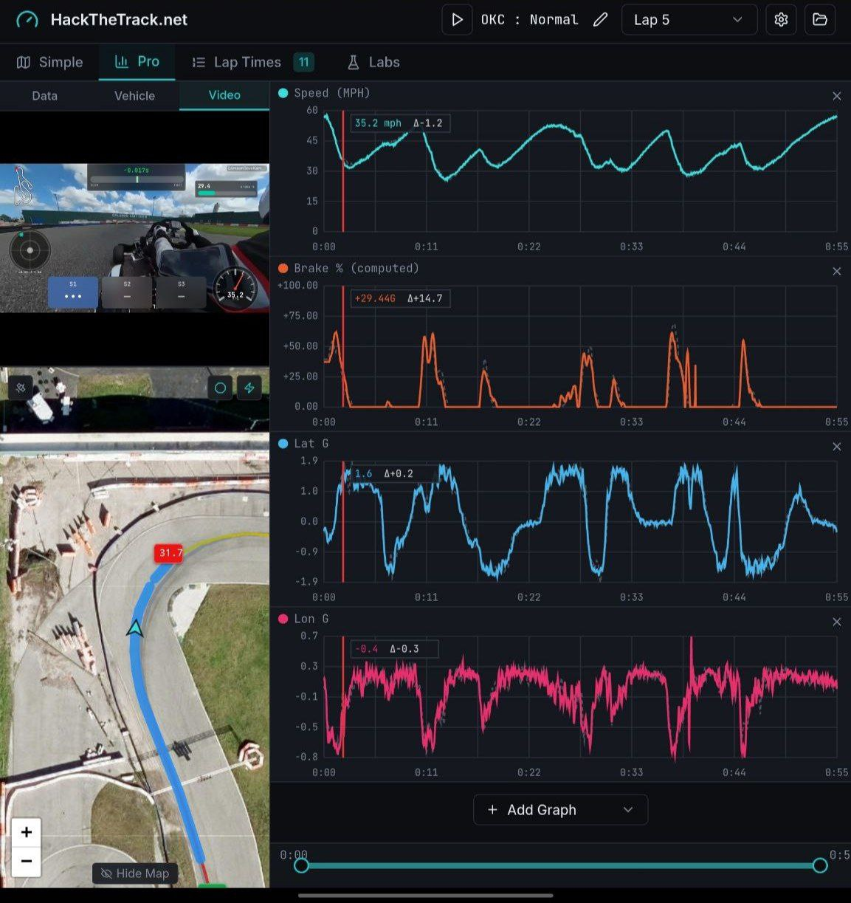

# Dove's DataViewer


**Open source motorsport data acquisition and analytics**

[](https://github.com/TheAngryRaven/DovesDataViewer/actions/workflows/lint.yml)
[](https://github.com/TheAngryRaven/DovesDataViewer/actions/workflows/typecheck.yml)
[](https://github.com/TheAngryRaven/DovesDataViewer/actions/workflows/test.yml)
[](https://github.com/TheAngryRaven/DovesDataViewer/actions/workflows/build.yml)
[](https://github.com/TheAngryRaven/DovesDataViewer/actions/workflows/coverage.yml)

🌐 **Live Demo:** [HackTheTrack.net](https://hackthetrack.net)  
🔧 **Hardware Project:** [DovesDataLogger on GitHub](https://github.com/TheAngryRaven/DovesDataLogger)

**Now officially in BETA status**
---

<p align="center">
  
</p>

---

## Features

- Multi-format file support (NMEA, UBX, VBO, MoTeC, AiM, Alfano, Dove, Dovex)
- Automatic track & course detection within 5 miles
- Automatic driving direction detection (forward/reverse)
- Waypoint mode — lap timing anywhere, no track needed
- Interactive race line map with speed heatmap
- Braking zone detection & visualization
- Automatic lap detection via start/finish line
- 3-sector split timing with optimal lap
- Pro graph view with multi-series telemetry charts
- Reference lap overlay & pace delta comparison
- Lap snapshots — save a "course fastest lap" per engine, frozen for cross-session comparison (local-first, optionally cloud-synced)
- Video sync with telemetry playback
- 9 overlay gauge types (digital, analog, graph, bar, bubble, map, pace, sector, lap time)
- MP4 video export with overlays & audio (H.264 + AAC)
- Vehicle profiles & setup sheet management
- Session notes per file
- BLE device integration (DovesDataLogger)
- Device track sync over Bluetooth
- Custom track & course editor with community submissions
- Local weather lookup
- Optional cloud sync of files & garage data across devices (requires backend + sign-in)
- Dark & light mode
- PWA — installable & fully offline

---

## Philosophy

This project is **100% open source**. The entire codebase—every feature, every parser, every visualization—is freely available for anyone to use, modify, and self-host.

- **Local Processing:** All data analysis happens in your browser. Your telemetry data never leaves your device.
- **No Server Required:** No uploads, no database, no accounts, no cloud sync.
- **Team Transparency:** Organizations can audit the code themselves for security compliance.

## Free Forever

- **Single file processing on HackTheTrack.net is always free**—no download or account required
- **Self-hosting is always an option**—clone this repo and run it yourself
- The only potential future paid feature: optional cloud storage for users who *want* hosted data retention on *my* infrastructure

---

## Supported File Formats

All formats are auto-detected on import:

| Format | Source | Extension |
|--------|--------|-----------|
| UBX Binary | u-blox GPS receivers | `.ubx` |
| VBO | Racelogic VBOX, RaceBox | `.vbo` |
| Dove CSV | DovesDataLogger | `.dove` |
| Dovex | DovesDataLogger (extended with metadata) | `.dovex` |
| Alfano CSV | Alfano ADA app, Off Camber Data | `.csv` |
| AiM CSV | MyChron 5/6, Race Studio 3 | `.csv` |
| MoTeC CSV | MoTeC i2 Pro export | `.csv` |
| MoTeC LD | MoTeC native binary | `.ld` |
| NMEA | Standard GPS sentences | `.nmea`, `.txt`, `.csv` |

---

## Tech Stack

| Layer | Technology |
|-------|------------|
| Framework | React 18 + TypeScript |
| Build | Vite |
| Styling | Tailwind CSS + shadcn/ui |
| Mapping | Leaflet (OpenStreetMap) |
| Charts | Custom Canvas 2D renderer |
| Video Export | WebCodecs + [mp4-muxer](https://github.com/Vanilagy/mp4-muxer) (H.264 MP4) |
| State | React Query |
| Backend | **None** – zero server dependencies (optional admin backend via Lovable Cloud) |
| BLE | Web Bluetooth API for DovesDataLogger device communication & settings |

---

## Admin Panel & Track Database (Optional)

The app includes an optional admin system for managing a community track database. When enabled, users can submit new tracks/courses for review, and admins can manage everything through a web interface.

**The app always reads tracks from `public/tracks.json` — zero database calls on normal page loads.** The database exists solely for the admin workflow.

### Environment Variables

| Variable | Required | Description |
|----------|----------|-------------|
| `VITE_SUPABASE_URL` | Yes (if using Cloud) | Backend URL (auto-set by Lovable Cloud) |
| `VITE_SUPABASE_PUBLISHABLE_KEY` | Yes (if using Cloud) | Backend public/anon key (auto-set by Lovable Cloud) |
| `VITE_SUPABASE_PROJECT_ID` | Yes (if using Cloud) | Backend project ID (auto-set by Lovable Cloud) |
| `VITE_ENABLE_ADMIN` | No | Set to `true` to enable admin UI and `/admin` route. `/login` mounts when admin OR cloud is enabled. Default `false` — a fresh clone ships the public, offline-first app, not admin UI pointed at an upstream backend. |
| `VITE_ENABLE_CLOUD` | No | Set to `true` to enable public user accounts: Cloud Sync Labs panel, email sign-in/registration, `/register`, `/forgot-password`, `/reset-password`, `/auth/callback`. Default `false` — flag-off builds ship zero cloud auth code (offline-first invariant). |
| `VITE_ENABLE_GOOGLE_AUTH` | No | Set to `true` to show the "Continue with Google" buttons (login, register, Profile). Requires `VITE_ENABLE_CLOUD`. Default `false`: Google sign-in currently routes through Lovable's hosted OAuth broker, so it stays hidden until native Supabase Google OAuth is configured (Google Cloud OAuth client + Supabase provider). |
| `VITE_TURNSTILE_SITE_KEY` | No | Cloudflare Turnstile site key for track submission CAPTCHA |
| `TURNSTILE_SECRET_KEY` | No | Cloudflare Turnstile secret key (edge function secret — `???`) |
| `STRIPE_SECRET_KEY` | No (required for paid tiers) | Stripe secret key used by the `create-checkout-session`, `stripe-webhook`, and `create-portal-session` edge functions (edge function secret — `???`) |
| `STRIPE_WEBHOOK_SECRET` | No (required for paid tiers) | Signing secret for the `stripe-webhook` endpoint, from the Stripe dashboard webhook config (edge function secret — `???`) |
| `DELETION_CRON_SECRET` | No (required for scheduled account deletion) | Shared secret the `process-account-deletions` edge function requires in the `x-cron-secret` header. Must match the Vault secret `deletion_cron_secret` that the daily pg_cron job sends (edge function secret — `???`) |
| `DOVE_PLUGIN_PACKAGES` | No | Build-time: comma-separated external plugin npm packages to load. Overrides the default (`@perchwerks/eye-in-the-sky`, the public AI coach) when set |

> **Note:** `TURNSTILE_SECRET_KEY` is a server-side secret stored in Lovable Cloud, not a `VITE_` client variable. If not set, Turnstile verification is skipped.

> **Build version stamp:** `VITE_APP_VERSION`, `VITE_GIT_HASH`, `VITE_BUILD_DATE`,
> `VITE_GIT_BRANCH`, and `VITE_GIT_COMMIT_DATE` are **not** configured by hand —
> `vite.config.ts` bakes them in automatically (from `package.json` and git) for
> the home-page footer version/commit stamp. The stamp mirrors the `_PREVIEW`
> backend switch: a `main` build shows **`v<version> · <hash>`**, while any other
> branch shows **`<branch> · <hash> · <commit time>`**. The commit hash prefers
> CI-provided SHAs (`WORKERS_CI_COMMIT_SHA` / `CF_PAGES_COMMIT_SHA` /
> `GITHUB_SHA`) and the branch prefers CI branch vars (`WORKERS_CI_BRANCH` /
> `CF_PAGES_BRANCH` / `GITHUB_REF_NAME`) so both are correct even on shallow
> checkouts, falling back to a local `git` call and then `"unknown"`.

> **Stripe / paid tiers:** `STRIPE_SECRET_KEY` and `STRIPE_WEBHOOK_SECRET` are
> edge-function secrets (not `VITE_` client vars). Prices are resolved live by
> **lookup_key** — there are no Price ids in code or env. Create the
> Plus/Premium/Pro Products in Stripe with one recurring Price per billing
> interval, each tagged with the matching lookup_key:
> `plus_monthly`, `plus_annual`, `premium_monthly`, `premium_annual`,
> `pro_monthly`, `pro_annual`. Then point a Stripe webhook (events:
> `checkout.session.completed`, `customer.subscription.created/updated/deleted`)
> at the `stripe-webhook` function URL. When `STRIPE_SECRET_KEY` is absent the
> pricing UI falls back to showing only the two free cards (Guest + Free). Use
> Stripe **test mode** first. Tier entitlements are granted only by the webhook,
> never the client.
>
> **On-hold / comped tiers:** the **Premium** and **Pro** (AI) tiers are listed in
> `COMING_SOON_TIERS` (`src/lib/billing.ts`, mirrored in `create-checkout-session`)
> so they're hidden from the pricing UI entirely and can't be bought via the app
> (only **Free** + **Plus** are shown at launch). To give one to a tester/friend,
> create the subscription directly in Stripe on the `premium_*` / `pro_*` price and
> set the subscription's `metadata.user_id` to their account id (or change an
> existing customer's price) — the webhook grants it. Remove the tier from both
> `COMING_SOON_TIERS` sets to open self-service purchase.
>
> **Cancellation grace + log trimming:** a cancelled subscription ends at the
> period boundary and drops to the free tier's limit immediately, but the
> user's cloud logs are kept for a 60-day grace window (`grace_until`). After it
> expires, the `trim_expired_logs()` function (scheduled daily via `pg_cron`)
> deletes their synced log files newest-first until their pooled total (docs +
> remaining logs + snapshots) fits the free `total_bytes` allowance; snapshots
> and garage docs are never auto-deleted. If `pg_cron` isn't enabled on the
> project, enable it (Dashboard → Database → Extensions) or invoke
> `select public.trim_expired_logs();` from an external scheduler.

> **Note:** `DOVE_PLUGIN_PACKAGES` is build-time only (read by `vite.config.ts`), not a client `VITE_` variable. It overrides which external plugin packages the build loads; by default the build pulls in the public AI coach (`@perchwerks/eye-in-the-sky`) from npm as an optional dependency — see `src/plugins/README.md`.

> **Build fallback:** `vite.config.ts` now hardcodes the project's public backend URL, publishable key, and project ID as a fallback for production builds. Local `.env` values still take precedence, but published builds no longer white-screen if managed env injection is temporarily missing.

> **PWA cache recovery:** the legacy `/sw.js` path now ships a one-release cleanup worker that deletes old app caches and unregisters itself without touching IndexedDB telemetry/session data. The active offline worker is now published at `/service-worker.js`, and HTML navigations use `NetworkFirst` to reduce the chance of users getting stuck on an old shell after future deploys.

### Database Setup

The admin system uses Lovable Cloud (Supabase) for the database. The schema is created automatically via migrations. Tables:

- **tracks** — Track names with short names (max 8 chars) and enabled flag
- **courses** — Course definitions with start/finish and optional sector lines
- **submissions** — User-submitted tracks/courses pending admin review
- **banned_ips** — IP addresses blocked from submissions
- **login_attempts** — Rate limiting for login (5 attempts, 1 hour lockout)
- **user_roles** — Admin/user role assignments (uses `has_role()` security definer)
- **sync_records** — Per-user cloud-sync documents (files/garage data), RLS-scoped to the owner
- **user-files** (Storage bucket) — Private per-user session file blobs for cloud sync
- **lap_snapshots** — Per-user frozen "course fastest lap" captures (one per course+engine), RLS-scoped; its own table, but its size counts toward the unified storage pool (below)
- **subscription_tiers** — Data-driven plan catalogue (free/plus/premium/pro): label, price, and a single pooled cloud-storage budget (`total_bytes`: 50 MB / 10 GB / 100 GB / 500 GB) shared by documents + logs + snapshots
- **user_subscriptions** — Per-user tier + Stripe customer/subscription state, status, renewal date, cancellation grace (service-role-written only)
- **profiles** — Per-user unique, editable display name
- **account_deletions** — Pending self-service account-deletion requests (7-day, reversible grace window)

> **Data retention (GDPR):** a daily `pg_cron` job runs
> `purge_expired_personal_data()`, which nulls the submitter IP on `submissions`
> and `messages` 90 days after they were received, deletes the rows entirely
> after 1 year (all `messages`; `submissions` only once reviewed — pending ones
> are kept for moderation), and deletes expired `banned_ips` / stale
> `login_attempts`. Account deletion is scheduled 7 days out
> (cancellable); the `process-account-deletions` worker then removes the user's
> Storage objects and auth row. To auto-schedule that worker, add a Supabase
> **Vault** secret named `deletion_cron_secret` and set the matching
> `DELETION_CRON_SECRET` env on the function, then re-run the GDPR migration —
> it wires the daily `pg_cron` + `pg_net` job for you.

> Cloud sync is independent of the admin system — it only needs a signed-in user
> account, not the admin role. It's an online-only, opt-in feature; the core app
> stays fully offline without it.

### Modular Database Layer

All database code lives behind `src/lib/db/` with a clean interface (`ITrackDatabase`). The current implementation uses Supabase, but you can swap in PostgreSQL/MySQL by implementing the same interface:

```
src/lib/db/
  types.ts            — Interface definitions
  supabaseAdapter.ts  — Supabase implementation  
  index.ts            — Factory: getDatabase()
```

### Admin Features

- **Submissions** — Approve/deny user-submitted tracks and courses
- **Tracks CRUD** — Add, edit, enable/disable, delete tracks (with short names)
- **Courses CRUD** — Manage courses per track with coordinate editing
- **Tools** — Build `tracks.json` from DB, download tracks ZIP, import JSON to rebuild DB, export/import course drawings
- **Banned IPs** — View and manage banned IP addresses, with a selectable expiry (TTL; defaults to 90 days, expired bans auto-purged)

### Edge Functions

| Function | Purpose |
|----------|---------|
| `submit-track` | Public endpoint for track submissions (with IP ban check) |
| `admin-build-zip` | Admin-only: generates per-track JSON files |
| `check-login-rate` | Rate limiting for login attempts |
| `submit-message` | Public contact-form endpoint (with IP ban + rate limit) |
| `stripe-prices` | Public: reports whether Stripe is configured + live monthly/annual prices (resolved by lookup_key) for the pricing UI |
| `create-checkout-session` | Auth: starts Stripe Checkout for a tier + interval |
| `create-portal-session` | Auth: opens the Stripe Billing Portal (manage/cancel/renewal) |
| `stripe-webhook` | Stripe-signed: the only writer of subscription tier/status + grace window |
| `export-account-data` | Authenticated: returns all server-side data for the caller (GDPR access/portability) |
| `request-account-deletion` | Authenticated: schedules the caller's account for deletion 7 days out |
| `process-account-deletions` | Cron-only (`x-cron-secret`): erases Storage objects + auth rows for accounts past their grace window |

### Track Short Names

Every track has a `short_name` (max 8 characters) used for:
- ZIP export filenames (`OKC.json`)
- Compact UI display in the header
- Falls back to `abbreviateTrackName()` for tracks without a short name

### First-Time Setup

1. Enable Lovable Cloud
2. Run the database migration (automatic)
3. Create an admin user via the auth system
4. Add the admin role: `INSERT INTO user_roles (user_id, role) VALUES ('<your-user-id>', 'admin');`
5. Set `VITE_ENABLE_ADMIN=true`

---

## Local Development

### Prerequisites

- Node.js 18+ (or [Bun](https://bun.sh))

### Installation

```bash
# Clone the repository
git clone https://github.com/your-username/doves-dataviewer.git
cd doves-dataviewer

# Install dependencies
npm install
# or: bun install

# Start development server
npm run dev
# or: bun dev
```

Open [http://localhost:8080](http://localhost:8080) in your browser.

### Available Scripts

| Command | Description |
|---------|-------------|
| `npm run dev` | Start dev server on port 8080 |
| `npm run build` | Production build to `dist/` |
| `npm run preview` | Preview production build locally |
| `npm run lint` | Run ESLint |
| `npm run typecheck` | Type-check via `tsc -b` (build mode — follows project references) |
| `npm test` | Run Vitest in watch mode |
| `npm run test:run` | Run Vitest once (CI-style) |

### Coverage badge

The live coverage badge is a [shields.io endpoint](https://shields.io/badges/endpoint-badge)
backed by a **GitHub Gist** (not a Git branch — that kept Cloudflare Workers
Builds trying to deploy a badge-only branch). The `coverage.yml` workflow runs
`npm run coverage:badge` (which computes the `%` + color from the Vitest summary)
and pushes those fields to the gist on every push to `main`. To wire it up on a
fork:

1. Create a **public** gist with a single file named `coverage-badge.json`
   (any placeholder contents) and copy its ID from the URL
   (`gist.github.com/<user>/<THIS_IS_THE_ID>`).
2. Create a fine-grained/classic **PAT with the `gist` scope** and add it as the
   repo secret **`GIST_TOKEN`** (Settings → Secrets and variables → Actions).
3. Add the gist ID as the repo **variable `COVERAGE_GIST_ID`** (same page → Variables).
4. Replace `COVERAGE_GIST_ID` in the Coverage badge URL at the top of this README
   with your gist ID.

---

## Deployment

The app is a **static single-page app** — `npm run build` emits a self-contained
`dist/` folder (HTML + hashed JS/CSS + assets) with no server runtime to host.
It runs on any static host. The optional admin backend (Supabase) is independent
and unaffected by where the frontend is served — the browser just calls it over
HTTPS.

### Cloudflare Workers

The repo ships ready for Cloudflare Workers (static assets) via the GitHub
integration / Workers Builds:

1. In the Cloudflare dashboard, create a **Worker** and connect this repo
   (Workers Builds).
2. Build settings:
   - **Build command:** `npm run build`
   - **Deploy command:** `npx wrangler deploy` (Workers Builds default).
   - **Node version:** pinned to `20` via `.nvmrc` (matches CI).
3. **`wrangler.jsonc`** (repo root) configures the deploy — there's no Worker
   script, just a static-assets binding:
   - `assets.directory: "./dist"` — uploads the Vite build output.
   - `not_found_handling: "single-page-application"` — returns the app shell
     (`index.html`) for unmatched client-side routes like `/privacy` and
     `/admin` instead of 404ing.
4. **`public/_headers`** is copied into `./dist` and honored by Workers static
   assets: it forces `no-cache` on the service workers + `index.html` (so new
   deploys take over instead of clients running a stale shell) and long-lived
   `immutable` caching on hashed `/assets/*`.

#### Environment variables (Worker → Settings → Variables)

The public viewer needs **none** — `vite.config.ts` hardcodes public backend
fallbacks, so a zero-config build serves the full offline app with admin off.

To run the admin/track-submission features on the Cloudflare deploy, set these
build-time variables (they're baked in at build, so a redeploy is required after
changing them):

| Variable | Value |
|----------|-------|
| `VITE_ENABLE_ADMIN` | `true` |
| `VITE_ENABLE_REGISTRATION` | `true` (only if you want the `/register` route) |
| `VITE_SUPABASE_URL` | your Supabase project URL |
| `VITE_SUPABASE_PUBLISHABLE_KEY` | your Supabase anon key |
| `VITE_SUPABASE_PROJECT_ID` | your Supabase project ID |
| `VITE_TURNSTILE_SITE_KEY` | optional — Turnstile site key for the contact/submission CAPTCHA |

`TURNSTILE_SECRET_KEY` stays a **Supabase edge-function secret** — it is never a
client variable and does not belong in Cloudflare. The Supabase edge functions
(`supabase/functions/`) continue to run on Supabase; the Worker only serves the
static frontend.

#### Preview-branch backend (Supabase Branching → preview deployments)

Pushes to a **non-production branch** produce a preview version/URL of the same
Worker. To point those preview builds at a Supabase **preview-branch database**
(so beta work doesn't touch production data), set parallel `*_PREVIEW` build
variables. Workers Builds exposes `WORKERS_CI_BRANCH` (Pages: `CF_PAGES_BRANCH`)
on every build; `vite.config.ts` prefers the `_PREVIEW` value of each key
whenever that branch isn't `main`, and ignores them on `main` and in local dev.

1. Enable **Branching** in Supabase, then copy the preview branch's URL, anon
   key, and project ref from the **Branches** panel.
2. In the Worker → **Settings → Build → Variables and Secrets**, add (alongside
   the production values):

   | Variable | Value |
   |----------|-------|
   | `HTT_SUPABASE_URL_PREVIEW` | preview branch URL |
   | `HTT_SUPABASE_PUBLISHABLE_KEY_PREVIEW` | preview branch anon key |
   | `HTT_SUPABASE_PROJECT_ID_PREVIEW` | preview branch project ref |

   Any key works the same way (e.g. `HTT_ENABLE_CLOUD_PREVIEW`). `VITE_*_PREVIEW`
   is also accepted. Add the Cloudflare preview URL to the preview branch's
   **Auth → Redirect URLs** so cloud sign-in works there.

---

## Project Structure

```
src/
├── components/       # React components
│   ├── ui/          # shadcn/ui base components
│   ├── admin/       # Admin panel tabs
│   ├── RaceLineView.tsx
│   ├── TelemetryChart.tsx
│   └── ...
├── lib/             # Parsers and utilities
│   ├── db/          # Modular database layer
│   ├── nmeaParser.ts
│   ├── ubxParser.ts
│   ├── vboParser.ts
│   ├── doveParser.ts
│   ├── alfanoParser.ts
│   ├── aimParser.ts
│   ├── motecParser.ts
│   └── ...
├── hooks/           # React hooks
├── pages/           # Route pages
└── types/           # TypeScript definitions
```

---

## Contributing

Contributions are welcome — new parsers, bug fixes, overlays, and reusability
rewrites especially. See **[CONTRIBUTING.md](CONTRIBUTING.md)** for dev setup,
coding conventions, how to add a new parser, and the PR checklist.

By participating you agree to abide by our Code of Conduct (`CODE_OF_CONDUCT.md`).

Found a security issue? Please follow the disclosure process in
**[SECURITY.md](SECURITY.md)** rather than opening a public issue.

Release history is tracked in **[CHANGELOG.md](CHANGELOG.md)**.

---

## Credits

Built on the shoulders of these incredible open-source projects and free services:

- [React](https://react.dev) · [Vite](https://vite.dev) · [TypeScript](https://www.typescriptlang.org)
- [Tailwind CSS](https://tailwindcss.com) · [shadcn/ui](https://ui.shadcn.com) · [Radix UI](https://www.radix-ui.com) · [Lucide Icons](https://lucide.dev)
- [Leaflet](https://leafletjs.com) · [OpenStreetMap](https://www.openstreetmap.org)
- [TanStack Query](https://tanstack.com/query) · [Sonner](https://sonner.emilkowal.dev) · [react-resizable-panels](https://github.com/bvaughn/react-resizable-panels)
- [mp4-muxer](https://github.com/Vanilagy/mp4-muxer) · [Savitzky-Golay (ml.js)](https://github.com/mljs/savitzky-golay) · [JSZip](https://stuk.github.io/jszip) · [fix-webm-duration](https://github.com/yusitnikov/fix-webm-duration)
- [IEM ASOS (Iowa State)](https://mesonet.agron.iastate.edu) · [NWS API](https://www.weather.gov/documentation/services-web-api)
- [MoTeC i2](https://www.motec.com.au) (file format reference)

Optional admin backend powered by [Supabase](https://supabase.com) via Lovable Cloud.

---

## License

Licensed under the **GNU General Public License v3.0 (or later)** — see
**[LICENSE](LICENSE)**. You are free to use, modify, and self-host; derivative
works that you distribute must also be released under the GPL.
